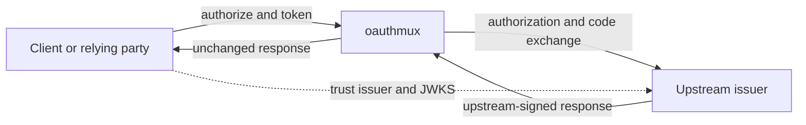
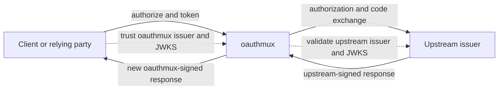

# oauthmux

`oauthmux` gives each OAuth/OIDC configuration one stable upstream callback URL and safely
multiplexes the result to an explicit set of application origins. It is both an embeddable Axum
router and a standalone server for containers or AWS Lambda.

The proxy supports authorization code flows with S256 PKCE, refresh tokens, OIDC discovery,
JWKS proxying, public and shared-secret application clients, and RFC 7523 `private_key_jwt`
clients. Upstream token response status, content type, and bytes are preserved during exchange.

## Upstream trust modes

Endpoint routing and token trust are separate concerns. An application can send authorization
and token requests through oauthmux while continuing to trust the upstream issuer, or it can
trust oauthmux as an issuer that validates and reissues the upstream identity.

### Transparent relay



### Brokered issuer



| Mode | Issuer and token signer | Endpoint ownership | Status |
| --- | --- | --- | --- |
| Transparent relay | Upstream | oauthmux serves `authorize` and `token`; upstream serves `jwks` and `userinfo` | Target |
| Brokered issuer | oauthmux | oauthmux serves discovery, `authorize`, `token`, `jwks`, and `userinfo` | Target |

The transport core required by both modes is implemented: oauthmux performs the upstream code
exchange and returns the upstream token response unchanged. Its discovery document identifies
oauthmux as the issuer while its `jwks` endpoint and returned ID token belong to the upstream
issuer. That issuer mismatch means the current discovery document is not a complete OIDC trust
contract. A client must validate the raw ID token against the configured upstream issuer and
audience.

Transparent relay keeps the upstream `iss` claim, signature, JWKS, and UserInfo contract. The
relying party explicitly configures the upstream issuer and routes only its authorization and
token requests through oauthmux. A discovery document fetched from an oauthmux URL cannot
portably advertise the upstream issuer: [OIDC Discovery][oidc-discovery] requires the URL used to
retrieve the metadata, the metadata `issuer`, and the ID token `iss` to match exactly. Consumers
that support manual endpoint configuration can use this mode without token reissuance.

Brokered issuer makes oauthmux the downstream issuer. oauthmux validates the upstream token and
issues a new token with its own `iss`, audience, signature, and JWKS. This is a new trust boundary,
not a transparent relay. The upstream issuer does not authorize oauthmux to issue tokens under
the upstream identity.

These semantics belong to each instance because different upstreams and relying parties can need
different trust models. A deployment-wide default can reduce repetition without preventing a
deployment from hosting both modes.

### Amazon Cognito

Amazon Cognito supports the transparent-relay layout. Its OIDC provider setup offers [Manual
input][cognito-oidc-idp] specifically for non-typical endpoint paths and alternate proxies.

| Cognito provider detail | Value |
| --- | --- |
| `oidc_issuer` | Upstream issuer |
| `authorize_url` | oauthmux `authorize` URL |
| `token_url` | oauthmux `token` URL |
| `attributes_url` | Upstream UserInfo URL |
| `jwks_uri` | Upstream JWKS URL |
| `client_id` | Upstream OAuth client ID |
| `client_secret` | Upstream OAuth client secret; configure the same credentials for oauthmux client authentication |

Cognito sends the client credentials with `client_secret_post`, which matches oauthmux's
shared-secret client authentication. The Cognito `/oauth2/idpresponse` origin must be in the
instance's redirect allow-list.

The `nonce` gap below prevents this flow from being Cognito-compatible yet: Cognito [generates and
validates a nonce][cognito-id-token] when it federates through a third-party identity provider.

[oidc-discovery]: https://openid.net/specs/openid-connect-discovery-1_0-errata1.html
[cognito-oidc-idp]: https://docs.aws.amazon.com/cognito/latest/developerguide/cognito-user-pools-oidc-idp.html
[cognito-id-token]: https://docs.aws.amazon.com/cognito/latest/developerguide/amazon-cognito-user-pools-using-the-id-token.html

## Development

[mise](https://mise.jdx.dev/) installs the repository's Rust toolchain:

```console
mise install
mise run check
```

The workspace contains the protocol engine, File and SSM providers, and the `oauthmux` binary.
Provider crates depend on `oauthmux-core`; the core has no provider-specific dependencies.

## Quickstart with a file provider

Create `config.yaml`:

```yaml
instances:
  google:
    issuer_url: https://accounts.google.com
    client_id: 1234.apps.googleusercontent.com
    client_secret: ${GOOGLE_SECRET}
    scopes: [openid, email, profile]
    allowed_redirect_origins: [https://app.example.com]
    default_redirect_uri: https://app.example.com/oauth/callback
    client_auth:
      mode: public
```

Then start the server:

```console
export GOOGLE_SECRET=upstream-client-secret
export OAUTHMUX_PUBLIC_URL=https://auth.example.com
export OAUTHMUX_SEAL_KEY="base64:$(openssl rand -base64 32)"
export OAUTHMUX_PROVIDER_FILE="$PWD/config.yaml"
cargo run -p oauthmux
```

The stable callback registered with the upstream provider is
`https://auth.example.com/oidc/google/callback`. Applications use the corresponding `authorize`,
`token`, discovery, and `jwks` endpoints under `/oidc/google/`.

The File provider accepts either `client_secret` or `client_secret_file`, exactly one per
instance. A value whose complete form is `${VAR}` is resolved from the process environment.
Invalid reloads retain the last valid snapshot.

## SSM provider

Set `OAUTHMUX_PROVIDER_SSM_PREFIX=/oauthmux/instances/`. Each recursive child parameter is one
instance, and its value is the YAML or JSON shape inside a File provider's instance entry.
Parameters are requested with decryption. `client_secret` is expected directly in the parameter;
`client_secret_file` is invalid for this provider. One malformed parameter is omitted without
preventing valid parameters from entering the snapshot.

A runtime role needs permissions equivalent to:

```json
{
  "Version": "2012-10-17",
  "Statement": [
    {
      "Effect": "Allow",
      "Action": "ssm:GetParametersByPath",
      "Resource": "arn:aws:ssm:REGION:ACCOUNT:parameter/oauthmux/instances/*"
    },
    {
      "Effect": "Allow",
      "Action": "kms:Decrypt",
      "Resource": "arn:aws:kms:REGION:ACCOUNT:key/KEY_ID"
    }
  ]
}
```

AWS region and credentials use the standard AWS SDK provider chain. When File and SSM both
contain an instance key, provider configuration order is deterministic: File is first, the
collision is logged, and the File instance remains active.

## Runtime configuration

| Variable | Meaning | Default |
| --- | --- | --- |
| `OAUTHMUX_PUBLIC_URL` | Externally visible absolute base URL | required |
| `OAUTHMUX_SEAL_KEY` | `base64:`-prefixed or raw base64 32-byte key | required |
| `OAUTHMUX_SEAL_KEY_PREVIOUS` | Previous 32-byte key accepted during rotation | unset |
| `OAUTHMUX_LISTEN` | Native server socket | `0.0.0.0:8080` |
| `OAUTHMUX_PROVIDER_FILE` | File provider YAML path | disabled |
| `OAUTHMUX_PROVIDER_FILE_POLL` | File mtime poll interval | `30s` |
| `OAUTHMUX_PROVIDER_SSM_PREFIX` | SSM hierarchy ending in `/` | disabled |
| `OAUTHMUX_PROVIDER_SSM_POLL` | SSM poll interval | `60s` |
| `OAUTHMUX_LOG` | `tracing` filter | `info` |

At least one provider must be enabled. Native mode exposes `/healthz` and reports `/readyz` only
after every provider has produced its initial snapshot. It polls providers until SIGTERM or
SIGINT and logs JSON when stdout is not a terminal.

### Lambda container runtime

The same image enters Lambda mode when `AWS_LAMBDA_RUNTIME_API` is present. Provider initialization
is part of the cold start: all first snapshots, normally from SSM, are merged into the registry
before the Lambda event loop starts. Provider poll tasks then stop because Lambda can freeze an
execution environment between requests. Each new execution environment loads a current SSM
snapshot. The handler and native server use the same Axum router.

Configure an API Gateway HTTP API or Lambda Function URL to forward every route to the image. Set
`OAUTHMUX_PUBLIC_URL` to that external URL and give the function role the SSM/KMS permissions
above. The Docker image contains the Lambda Runtime API client through the binary's default
`lambda` feature; no Lambda base image or custom bootstrap is required.

## Client authentication

`client_auth.mode` accepts:

- `public`: application PKCE is mandatory and only `S256` is accepted.
- `client_secret`: `client_id` and `client_secret` form fields are checked in constant time.
- `private_key_jwt`: `client_id`, `client_assertion_type`, and `client_assertion` are required.
  `jwks` is either an inline JWKS object or an HTTPS URL. The assertion issuer and subject equal
  the client ID, its audience equals the instance's proxy token endpoint, and its signature and
  expiration must validate.

Redirect targets require an exact configured HTTP(S) origin. HTTP loopback targets on
`localhost`, `127.0.0.1`, and `::1` are also valid for local development. Wildcards and URL-prefix
matching are not used.

## Known gaps

- The authorization endpoint does not accept or forward `nonce`. An OIDC relying party cannot
  bind the upstream ID token to its authorization request, and Cognito's third-party IdP flow
  cannot validate the nonce it generates.
- Transparent relay behavior and instance-level relay/broker selection are not implemented.
- Brokered issuer requires upstream-token validation, downstream token issuance, an oauthmux-owned
  JWKS, and UserInfo support.
- Redirect trust policy supports origins only. It needs explicit matcher types for exact callback
  URIs and constrained path templates whose placeholders match one path segment. Scheme, host,
  and port remain exact; raw regular expressions and general URL wildcards are outside the policy
  language.

## Sealing, rotation, and replay

Transient state and authorization codes are compact XChaCha20-Poly1305 envelopes. The current key
seals all new envelopes. During a rotation, set the new key as `OAUTHMUX_SEAL_KEY` and retain the
active key as `OAUTHMUX_SEAL_KEY_PREVIOUS` for at least ten minutes. Remove the previous key after
all envelopes under it have expired. Key material and envelope plaintext are never logged.

The standalone binary enables an in-memory replay cache. A code is single-use within one native
replica or one warm Lambda execution environment. Without a `ReplayCache`, including an embedding
that deliberately omits one, a sealed authorization code remains reusable for its five-minute
lifetime. A distributed deployment that requires global single-use semantics must inject a
shared `ReplayCache` implementation.

Authorization codes carry the raw upstream token response through the application redirect.
Responses that produce a sealed code larger than roughly 4 KB are logged because browser and
intermediary URL limits can reject them.

## Embedding

`oauthmux-core` exports `InstanceResolver`, `MuxConfig`, `KeyStrategy`, and `router`. Resolution is
performed for every request, so a database-backed host can expose live configuration directly.
`KeyStrategy::TwoSegment` maps `/oidc/{project}/{extension}/...` to the instance key
`{project}/{extension}`. The crate-level documentation contains a compiling HashMap-backed mount
example.
